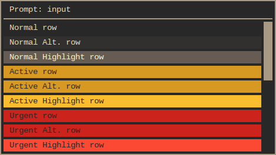
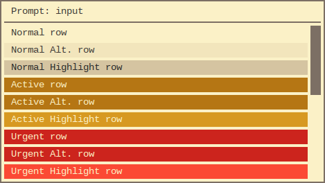

# gruvbox-rofi

> Gruvbox dark and light color themes for Rofi

[Rofi](https://github.com/DaveDavenport/rofi) color themes based on the
[Gruvbox color scheme](https://github.com/morhetz/gruvbox).

Includes six versions to choose from:

-   **[Gruvbox Dark](#dark-gruvbox-darkrasi)**
    -   [Gruvbox Dark (soft contrast)](#dark-soft-contrast-gruvbox-dark-softrasi)
    -   [Gruvbox Dark (hard contrast)](#dark-hard-contrast-gruvbox-dark-hardrasi)
-   **[Gruvbox Light](#light-gruvbox-lightrasi)**
    -   [Gruvbox Light (soft contrast)](#light-soft-contrast-gruvbox-light-softrasi)
    -   [Gruvbox Light (hard contrast)](#light-hard-contrast-gruvbox-light-hardrasi)

## Screenshots

### Dark ([`gruvbox-dark.rasi`](gruvbox-dark.rasi))



#### Dark (soft contrast) ([`gruvbox-dark-soft.rasi`](gruvbox-dark-soft.rasi))

")

#### Dark (hard contrast) ([`gruvbox-dark-hard.rasi`](gruvbox-dark-hard.rasi))

")

### Light ([`gruvbox-light.rasi`](gruvbox-light.rasi))



#### Light (soft contrast) ([`gruvbox-light-soft.rasi`](gruvbox-light-soft.rasi))

")

#### Light (hard contrast) ([`gruvbox-light-hard.rasi`](gruvbox-light-hard.rasi))

")

## Installation

These themes are included with Rofi as of version
[1.3.0](https://github.com/DaveDavenport/rofi/releases/tag/1.3.0). Run
`rofi-theme-selector` to preview/apply them with Rofi's theme selector
script.

See [Manual Installation](#manual-installation) if you wish to install the
themes manually. This may be preferable if you plan on customizing them.

### Manual Installation

1.  [Download](https://github.com/bardisty/gruvbox-rofi/archive/master.zip)
    or clone the repository:

    ```shell
    git clone https://github.com/bardisty/gruvbox-rofi ~/.config/rofi/themes/gruvbox
    ```

2.  Edit your Rofi configuration file (`~/.config/rofi/config`):

    ```xdefaults
    rofi.theme: ~/.config/rofi/themes/gruvbox/gruvbox-dark.rasi
    ```

## Links

-   [Rofi](https://github.com/DaveDavenport/rofi) window switcher, run
    launcher, ssh dialog, and dmenu replacement
-   [Gruvbox](https://github.com/morhetz/gruvbox) color scheme for Vim

## License

[MIT](LICENSE)
