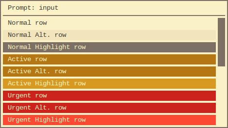

# gruvbox-rofi

> Gruvbox dark and light color themes for Rofi

[Rofi](https://github.com/DaveDavenport/rofi) color themes based on the
[Gruvbox color scheme](https://github.com/morhetz/gruvbox).

Includes six versions to choose from:

- __[Gruvbox Dark](#dark-gruvbox-darktheme)__
  - [Gruvbox Dark (soft contrast)](#dark-soft-contrast-gruvbox-dark-softtheme)
  - [Gruvbox Dark (hard contrast)](#dark-hard-contrast-gruvbox-dark-hardtheme)
- __[Gruvbox Light](#light-gruvbox-lighttheme)__
  - [Gruvbox Light (soft contrast)](#light-soft-contrast-gruvbox-light-softtheme)
  - [Gruvbox Light (hard contrast)](#light-hard-contrast-gruvbox-light-hardtheme)

## Screenshots

### Dark ([`gruvbox-dark.theme`](gruvbox-dark.theme))


#### Dark (soft contrast) ([`gruvbox-dark-soft.theme`](gruvbox-dark-soft.theme))

")

#### Dark (hard contrast) ([`gruvbox-dark-hard.theme`](gruvbox-dark-hard.theme))

")

### Light ([`gruvbox-light.theme`](gruvbox-light.theme))



#### Light (soft contrast) ([`gruvbox-light-soft.theme`](gruvbox-light-soft.theme))

")

#### Light (hard contrast) ([`gruvbox-light-hard.theme`](gruvbox-light-hard.theme))

")

## Installation

1. [Download](https://github.com/bardisty/gruvbox-rofi/archive/master.zip)
   or clone the repository:

   `git clone https://github.com/bardisty/gruvbox-rofi`

2. Edit your `~/.Xresources` file and include one of the themes:

   ```xdefaults
   #include /home/user/path/to/gruvbox-dark.theme
   ```

3. Merge your edited `.Xresources` file with `xrdb`:

   `xrdb -merge ~/.Xresources`

### Example Install

The following commands will install the dark theme. *Replace `your-user` in
step 3 with your system user account name.*

1. `mkdir -p ~/.Xresources.d/rofi/themes/gruvbox`
- `git clone https://github.com/bardisty/gruvbox-rofi ~/.Xresources.d/rofi/themes/gruvbox`
- `echo '#include "/home/your-user/.Xresources.d/rofi/themes/gruvbox/gruvbox-dark.theme"' >> ~/.Xresources`
- `xrdb -merge ~/.Xresources`

## Links

- [Rofi](https://github.com/DaveDavenport/rofi) window switcher, run dialog,
  and dmenu replacement
- [Gruvbox](https://github.com/morhetz/gruvbox) color scheme for Vim

## License

[MIT](LICENSE)
